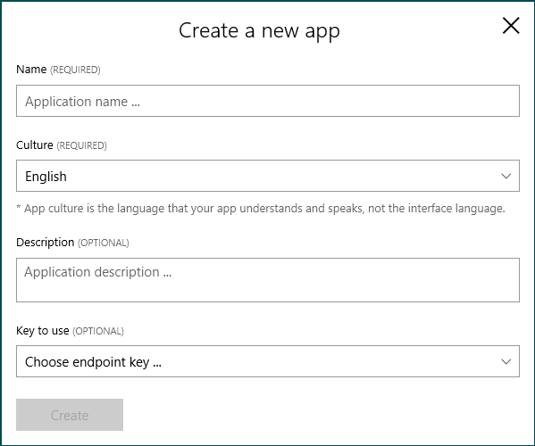
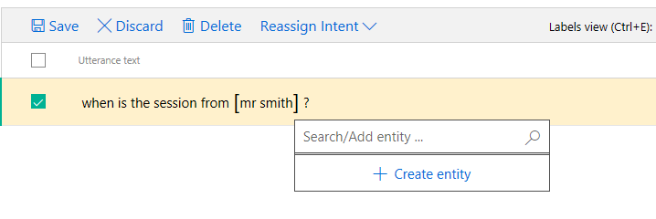
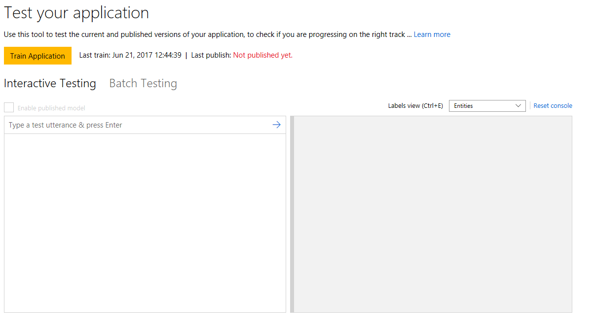
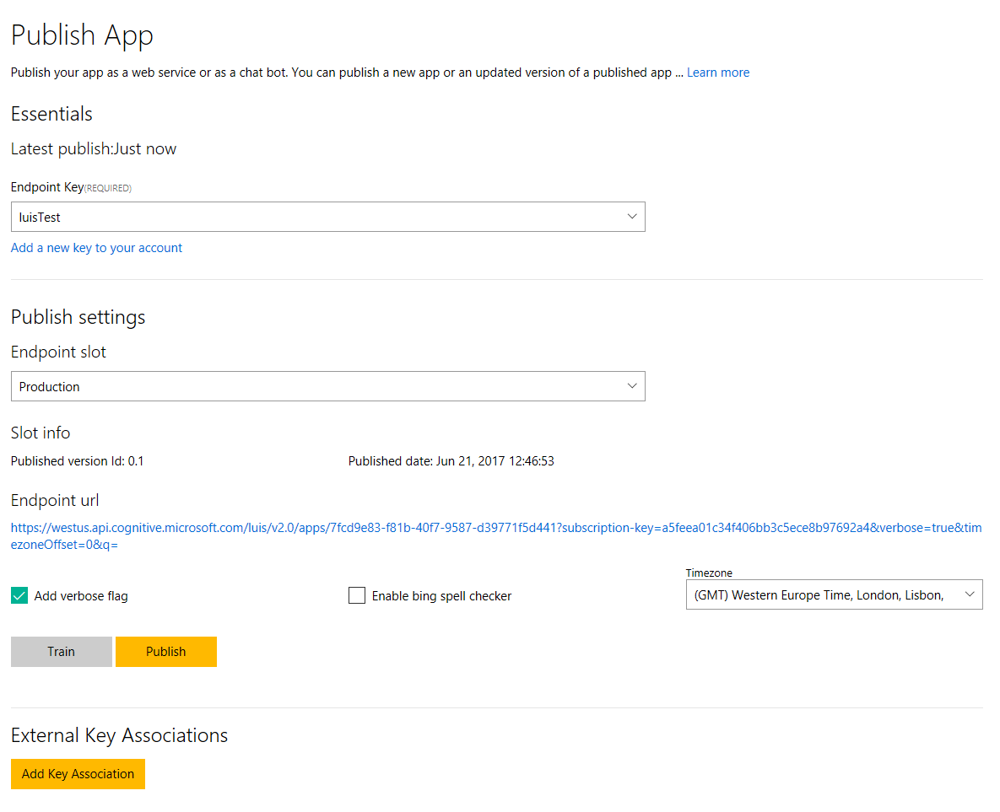

# CommunityEventBot
A Bot to get information on your community event. The bot is written in C#.

## Initial Bot Setup ###

To get started with bot, you first have to install the Bot Builder SDK, which is available via Nuget. A [template of a sample bot](http://aka.ms/bf-bc-vstemplate) to start with is also available on the [Bot Framework documentation website](https://docs.microsoft.com/en-us/bot-framework/).

Set the bot up as explained on the [Create a bot for .NET website](https://docs.microsoft.com/en-us/bot-framework/)

## Database setup ##

To get the information about the event, any kind of storage can be used that is connectable to the C# bot environment. In this example, we use a SQL database. A sample SQL query looks like this:

```sql
SELECT [id]
      ,[speakerName]
      ,[speakerDescription]
      ,[speakerImage]
      ,[talkTitle]
      ,[talkDescription]
      ,[talkTime]
      ,[talkTrack]
  FROM [dbo].[eventinfoextended]
```

Fill the database with the information needed for the event bot. To do this, use a tool of your choice. I recommend using the [SQL Management Studio](https://docs.microsoft.com/en-us/sql/ssms/download-sql-server-management-studio-ssms).

## LUIS setup ##

After the data is included in the database we have to figure out, what kinds of questions the user wants to ask the bot. In this simple scenario we want to get answers to the following questions:

1. When is the next talk?
2. What is \<speaker> talking about?
3. When is the session from \<speaker>?

These questions will be mapped to 3 **intents**:

1. talk.speaker
2. talk.content
3. talk.time


The value of \<speaker> is stored in an **entity** called: **speakerName**

To provide the functionality to recognize these intents from users questions, the Cognitive Service LUIS is used. To learn more about LUIS, you can visit the [LUIS web portal](https://www.luis.ai/home/index).

We train each intent with 5-10 phrases that we expect the user to say, when he wants the specific information. 

### LUIS Training ###

To train and publish you LUIS model, follow the steps as described:

1. Create a new app on [luis.ai](https://www.luis.ai/applications)

    

1. Go to intents and create a new intent

    

1. Add phrases to the intent

    Add the phrases the service should understand, but don't worry, because LUIS is an intelligent service, it can adapt to changes in the query, so if a word is missing or added or the word order is changed, it will still trigger the intent as intended - or should I say: **intented** :laughing:

    **Sorry!** 

    

1. Create a new entity to recognize properties

    To add a entity, select the values that will be dynamic by clicking on them. Type a name and click "Create entity".

    

1. Training the service

    

1. Publish the service

    


# Bot development


